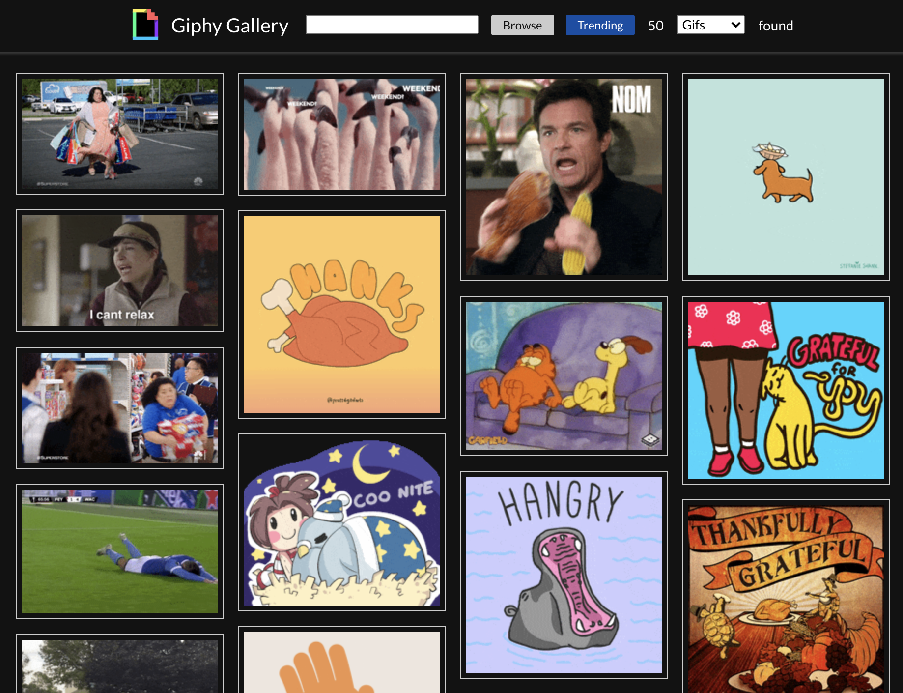

# Giphy Gallery

---

Giphy Gallery is a simple Giphy browser, which implements the following basic features:

1. Display grid of trending GIFs on Giphy, allowing "infinitely scrolling" to see more results.
2. Search bar on top that will allow a user to search for GIFs by keyword. The results will *replace* the trending GIFs.
3. By clicking click on a GIF, it will open a larger image in full-screen view mode.
4. Browse images by type: gifs or stickers;

NOTE: This project has educational purpose only. [Demo](https://giphygallery.netlify.app/)

## Technical Summary

This project was bootstrapped with [Create React App](https://github.com/facebook/create-react-app) using the typescript template and developed with a minimum set of tools and libraries:

- Typescript
- Functional React components and hooks-
- Redux
- Styled Components

Some design decisions:

- Components would be styled using Styled Components for a better code organization;
- Files should have the least amount of lines of code, so it was limited to 100;
- It was respected the single responsibility principle;
- Components were memoized to improve performance;
- For the full screen gif display, it was applied a simple css only solution, based on target pseudo selectors and css transformation;
- Added the extra functionality of being able to select the resource type: either gifs or stickers;
- The infinite scrolling implementation is naive, efforts were focused to implement the requirements in a short time frame. As a tradeoff, the scrolling is not very smooth;

This project was developed within a time frame of 8 hours

### Available Scripts

All the available scripts can be seen [here](./SCRIPTS.md):

## TODO

- [ ] Improve Infinite Scrolling experience
- [ ] Write unit tests ([jest](https://jestjs.io/) and [enzyme](https://enzymejs.github.io/))
- [ ] Write integration tests ([cypress](https://www.cypress.io/))
- [ ] Error handling

Other cool functionalities:

- [ ] Allow user to favorite giphy
- [ ] Select how many items to be displayed per page
- [ ] Add a Dark/Light mode selector
- [ ] ...
